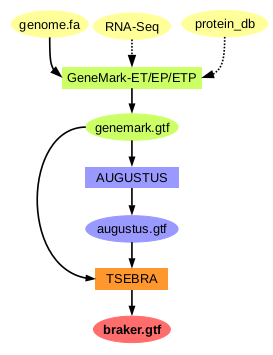

# Refining the Genome Annotation of Abeoforma whisleri: Improving Gene Prediction for Downstream Comparative Analysis
This project implements a pipeline for annotating the genome of *Abeoforma*. The pipeline includes 
RNA-seq alignment, genome masking, and gene annotation using tools like HISAT2, Portcullis, and 
BRAKER...

This repository includes:
1. A structural and functional reannotation pipeline for *Abeoforma whisleri*
2. The creation of a custom BUSCO database for unicellular holozoans

### 1. annotation/
Contains all scripts and results related to genome annotation.

- `scripts/`: Annotation pipeline scripts, including genome annotation, RNA-seq processing, and external evidence integration
- `data/`: Input RNAseq and protein data
- `results/`: Analysis of the structural and functional annotation

### BRAKER3 Pipeline Overview

*Figure 1: Schematic view of the BRAKER3 pipeline, adapted from Brůna et al. (2024), licensed under CC BY 4.0.*

> Brůna, T., Gabriel, L., & Hoff, K. (2024). Navigating eukaryotic genome annotation pipelines: A route map to BRAKER, Galba, and TSEBRA. *arXiv*. https://doi.org/10.48550/arXiv.2403.19416

### 2. Busco_db/
Contains scripts and files to create a custom BUSCO database.

- `scripts/`: Scripts to process scores and generate dataset files
- `my_busco_dataset_odb10/`: Final BUSCO dataset
- `busco_input/`: Input orthologs used to create the DB

## Project Information
**Author:** Alba Mas i Puig  
**Final Degree Project:** Bioinformatics  
**Institution:** ESCI-UPF  
**Date:** june 2025
