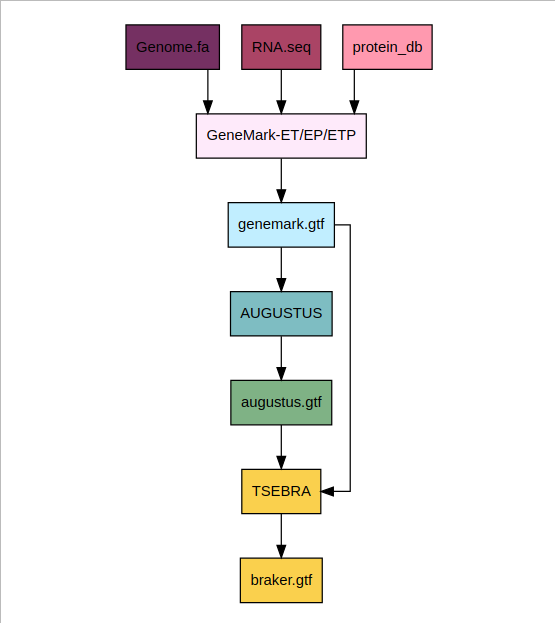

# Refining the Genome Annotation of Abeoforma whisleri: Improving Gene Prediction for Downstream Comparative Analysis

This repository includes:
1. A structural and functional re-annotation pipeline for *Abeoforma whisleri*
2. The creation of a custom BUSCO database for unicellular holozoans

### 1. Annotation/
Contains all scripts and results related to genome annotation.

- `scripts/`: Annotation pipeline scripts, including genome annotation, RNA-seq processing, and external evidence integration
- `data/`: Input RNAseq and protein data
- `results/`: Analysis of the structural and functional annotation

### BRAKER3 Pipeline Overview

*Diagram illustrating the BRAKER3 workflow, showing the integration of genome, RNA-seq, and protein database inputs.*

### 2. Busco_db/
Contains scripts and files to create a custom BUSCO database for unicellular holozoans.

- `scripts/`: Scripts to process scores and generate dataset files
- `uni_holozoans_odb10/`: Final BUSCO dataset

## Project Information
**Author:** Alba Mas i Puig  
**Final Degree Project:** Bioinformatics  
**Institution:** ESCI-UPF  
**Date:** june 2025

**Hosting Institution:** Institute of Evolutionary Biology (IBE), CSIC-UPF  
**Research Group:** Multicell Genome Lab (MCG Lab)  
**Supervisor:** Marta Álvarez-Presas

  
  
  

